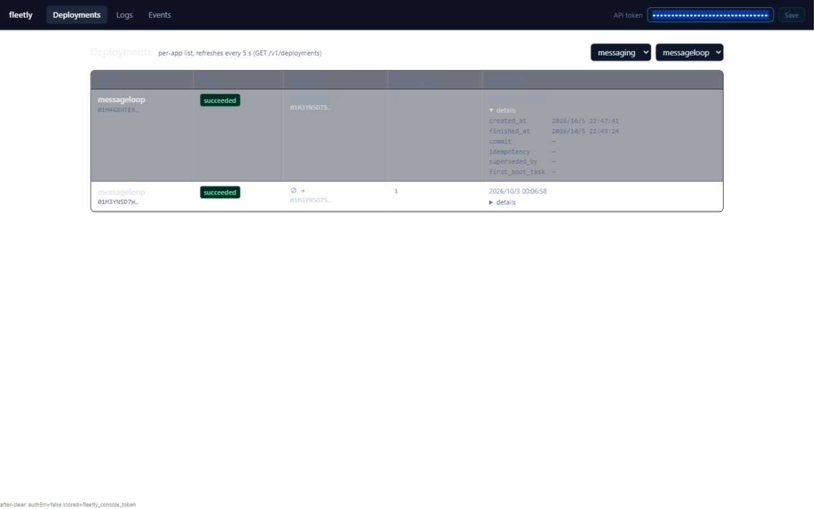
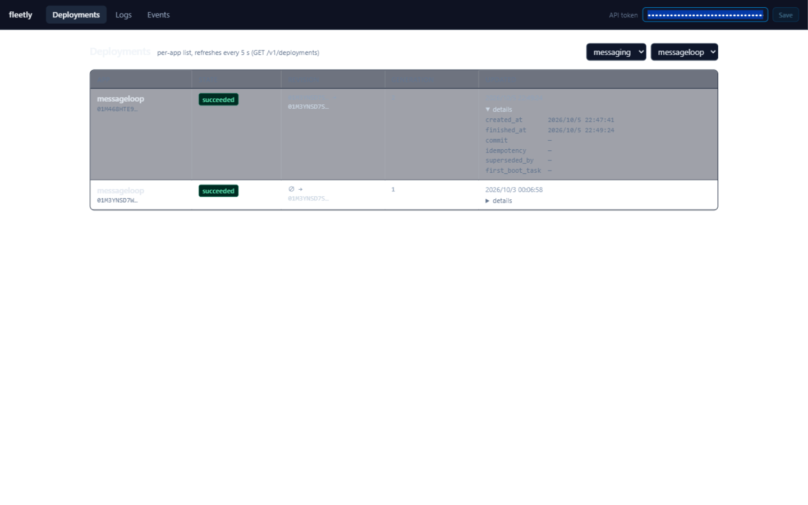
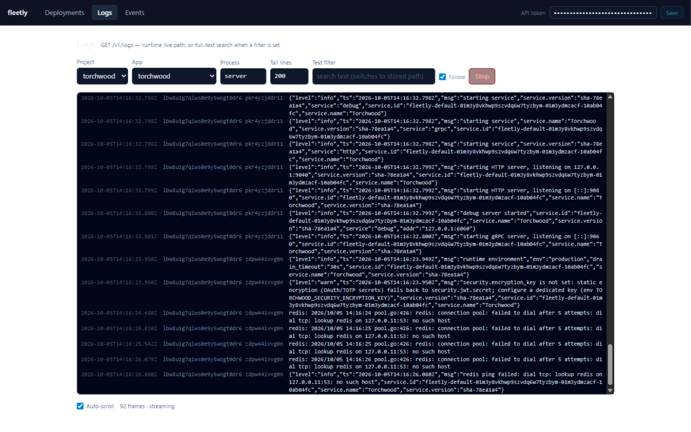
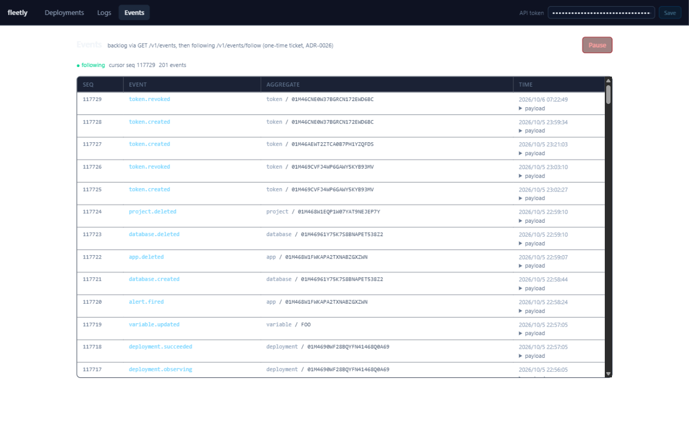
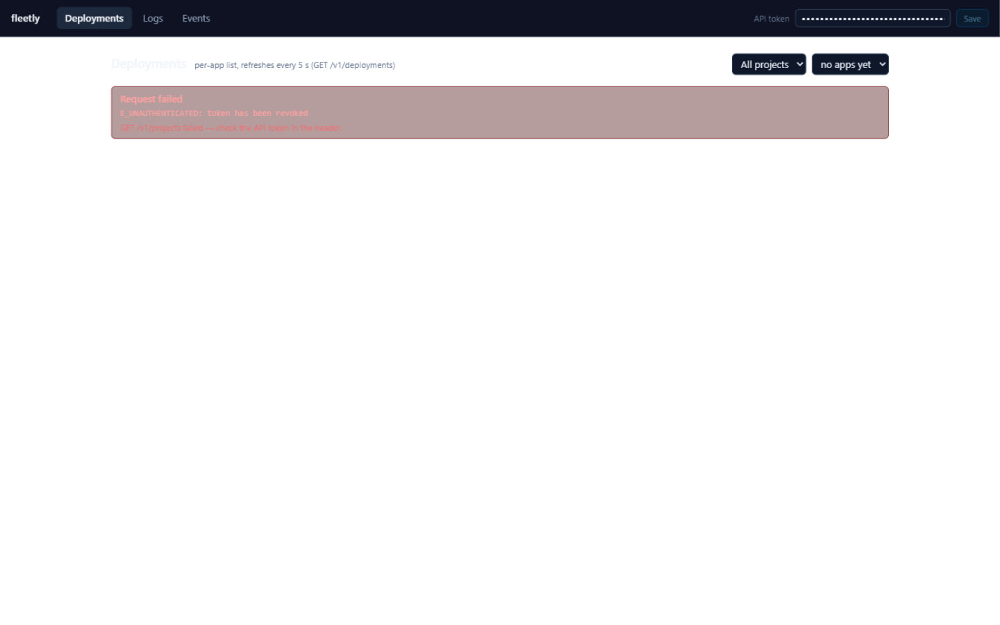

# fleetly Console 浏览器走查报告（F2.6 收尾，2026-10-05/06）

真实浏览器（ZCode IAB / Chromium，视口 1440×900）对 staging 现役 Console 的 UI 层走查。HTTP 面与消费契约此前已由另一环境对拍通过（runbook 记录·七），本报告补渲染/交互/路由/轮询与流的活体形态。

- **对象**：`http://127.0.0.1:19527`（SSH 隧道 → manager 127.0.0.1:9081），SPA bundle `assets/index-9-nMJr5D.js`
- **凭证**：`fleetly tokens create --role builtin-member console-walk`（id `01M46AEWT2ZTCA0B7PH1YZQFDS`），走查中另铸 `console-walk2`（`01M46CNE0W37BGRCN172EWD6BC`）用于 SSE 活体与 401 态；两枚均已吊销，secret 不入报告
- **JS 报错监测**：每次页面装载后注入 `error` + `unhandledrejection` 收集器，全程读数恒为空

## 环境注记（复现必读，均非 Console 缺陷）

1. **本机 18081 端口被 Docker Desktop 劫持**：`wslrelay.exe` 监听 `[::1]:18081`，浏览器对 `localhost` 优先走 IPv6，拿到的是另一个服务的 404 JSON（`{"message": "Not found", "code": 404}`）而非 Console。已改用显式绑定 `127.0.0.1` 的干净端口 19527。runbook 建议补一句：本机走查用 `ssh -N -L 127.0.0.1:<port>:127.0.0.1:9081` 且浏览器地址栏写 `127.0.0.1`。
2. **本机 env 代理 7078 是陈旧值**，curl 不带 `--noproxy '*'` 会被吞（502/挂起/链式输出失真）。
3. **IAB 截图管线有双重曝光伪影**：下方截图里 "Deployments" 标题与描述文字、表格行文字出现重影。已用几何探针证伪——`h1`（x 160–268）与段落（x 280–569）不相交、行内两行文字 y 严格相邻（329+20=349）、`document.getAnimations()=0`，页面真实布局无重叠。**截图重影请勿当 UI 缺陷**。

## 逐页判据

### 部署状态 `#/deployments` —— 全部通过

| # | 判据 | 结果 | 证据 |
|---|---|---|---|
| ① | Project 目录 5 个项目 | ✅ | n0reg / n0probe / quickstart / torchwood / messaging 全部出现在下拉 |
| ② | 选 torchwood → App 下拉自动选首个 app | ✅ | App 下拉自动选中 `torchwood`（共 4 apps：torchwood/buildprobe/staticprobe/railpackprobe），部署表随之出数 |
| ③ | 历史部署列表 | ✅ | 13 代完整（gen 1–13），最新 gen 13 `succeeded`；失败行带具体原因（health gate L1 超时 / first boot job "roles-sig" exit 1 / "migrate" exit 2/3） |
| ④ | 轮询刷新不报错不闪烁 | ✅(带注) | fetch 时间戳实测：visible+focused 标签页、15s 窗口 2 次 `/v1/deployments`、**间隔 7052ms**；页面自述 "refreshes every 5 s"。无报错、无闪烁、DOM 无抖动。偏差疑似「上次请求完成后才重排 5s 定时器 + 隧道 RTT」，属观察项非缺陷（见 O1） |
| ⑤ | messageloop 今日 replay 部署 | ✅ | gen 2 `succeeded`，revision 同 revision（`01M3YNSD7S… → 01M3YNSD7S…`，replay 语义在 UI 可辨）；时间 2026/10/5 22:49:24（本地）↔ API 原始 `14:49:24Z`，**本地时区（UTC+8）渲染正确** |

- **details 展开**：`created_at`/`finished_at` 本地时区；空值（commit/idempotency/superseded_by/first_boot_task）显示 `—`，无 null/undefined 泄漏。
- 截图：（含 details 展开）、

### 日志 `#/logs` —— ①③ 通过，② 无法验证（应用侧无日志），另有三个发现

| # | 判据 | 结果 | 证据 |
|---|---|---|---|
| ① | tail 拉历史行、NDJSON 解码 | ✅ | process=`server`、tail 200：表格三列（时间 / 节点+容器 / 消息），base64 `line` 全部解码为原文（torchwood 的 JSON 日志行原样等宽渲染），长行单元格内横向滚动不破版 |
| ② | follow 活体增量 | ⚠️ 无法验证 | 打流量（`/` 与 404 路径各 3–5 发，manager 侧实测 200/30ms 可达）后 45s+ 存储路径最新日志时间戳停在 14:16:33Z（app 启动期）——**torchwood server 不打访问日志**，数据源静默。follow 流本身健康：`92 frames · streaming`、连接保持 4 分钟+、零报错 |
| ③ | 停流后连接保持 | ✅ | 停止打流量后流保持 streaming 态，无白屏无报错 |

- 截图：（92 frames · streaming，此张几乎无伪影，可作渲染基准）

**发现（按严重度）：**

- **F1·UI 中危：Stop 按钮失效且反向触发重查**。点击 Stop 后按钮不翻回 Start（两轮复现）；且每次点击实际**重新发起了同 URL 的 follow 查询**（fetch 计数 3→4），新流不消费响应——页面永久停在 "Waiting for frames…" / `0 frames · streaming`。同参数 curl 对拍服务端立即回 46KB tail，坐实是前端消费面问题。
- **F2·服务端高危：`text` 过滤与 `follow=1` 组合挂死**。`GET /v1/logs?...&text=redis&follow=1` 12s 零字节、响应头都不发；同参去掉 follow 2.6s 回 46KB 匹配行。Console 默认勾选 Follow + 填过滤词 = 必然踩中，且 UI 无超时无报错（永久 "Waiting for frames…"）。**UI 默认态引爆服务端缺陷**，建议服务端修 hang、UI 侧补请求超时与错误面。
- **F3·UX 低危：空流无提示**。process 填不存在的名字（如 `web`）时服务端 0.5s 返回空 200 关流，UI 无任何「无此 process / 无帧」提示，同样永久 "Waiting for frames…"。
- **O1·观察：日志时间列是原始 UTC ISO**（`2026-10-05T14:16:24.123Z`），而部署/事件页均为本地化格式（`2026/10/5 23:21:03`）——跨页时区呈现不一致。
- **O2·观察：行序按 workload 分组**，同窗口跨容器非全局时间序；排障时读序需留意。

### 事件流 `#/events` —— 全部通过

| # | 判据 | 结果 | 证据 |
|---|---|---|---|
| ① | status 定锚 + 有界补档后 follow | ✅ | 页头自述 "backlog via GET /v1/events, then following /v1/events/follow (one-time ticket, ADR-0026)"；装载后直接锚在头部 seq（117727）转 `● following`，**只补 200 条有界窗口**，未从旧游标翻积压 |
| ② | 今日事件可见 | ✅ | 200 条窗口（seq 117528–117729，约 90 分钟）内：`token.created`/`token.revoked`（正是走查 token 自身）、`variable.updated`、`alert.fired`、`database.created`、`app.deleted`、`project.deleted`、`deployment.queued/preparing/observing/releasing/succeeded` 全家族、`workload.drift_detected`、`node.left`、`network.rebuilt`、`platform.backup_succeeded` |
| ③ | 11.5 万 `database.backup_failed` 积压的页面行为 | ✅(如实记录) | **无刷屏无卡顿**：有界窗口内命中 157 条（风暴尾巴集中在最近 90 分钟，属数据现状），渲染流畅；失败 payload 完整可展开（network not manually attachable 错误全文可读），payload 展开为 pretty JSON |
| ④ | SSE 活体推进 | ✅ | 两次实测：铸 `console-walk2` 后 `token.created` 实时上顶（cursor 117727→117728、200→201）；吊销后 `token.revoked` 再次实时上顶（117728→117729、200→201，事件落地与页面呈现秒级） |
| - | 隔夜观察 | 注 | 23:59 → 次日 07:22 之间**零事件**——备份风暴退避修复批上线后完全静默，旁证修复生效 |

- 截图：（● following / cursor seq 117729 / 201 events，顶部即重试产生的 token.revoked）

### 全局 —— 全部通过

| # | 判据 | 结果 | 证据 |
|---|---|---|---|
| ① | 直接改 hash 到三路由各刷新 | ✅ | `#/deployments` `#/logs` `#/events` 三个 URL 直接装载，各自渲染正确 h1 与视图（SPA 路由活体） |
| ② | 刷新后 Token 仍生效 | ✅ | localStorage 键 `fleetly_console_token`，reload 后数据照常拉取；清空输入框后轮询依旧鉴权通过（token 不依赖输入框驻留） |
| ③ | 错 token → 401 态不白屏 | ✅ | 填入已吊销 secret 保存后，红色错误面板：`Request failed / E_UNAUTHENTICATED: token has been revoked / GET /v1/projects failed — check the API token in the header.`，布局完好 |
| ④ | devtools Console 无 JS 报错 | ✅ | 全程（含 401 阶段、SSE 阶段、路由切换）`error` + `unhandledrejection` 收集器恒空 |
| - | Token 输入框掩码 | ✅ | 截图可见输入框渲染为圆点，secret 不以明文出现在页面截图 |

- 截图：

### 低危 UX 瑕疵（非判据内）

- **F4**：首次装载拿到项目列表后，页面立即用空 `project_id` 发 `GET /v1/apps`，吃回 `E_INVALID_ARGUMENT: project_id: must not be empty` 并渲染错误面板，且提示语误导（"check the API token"）。应跳过空查询或换成空态提示。

## 结束动作（已全部执行）

- `fleetly tokens revoke` × 2（console-walk / console-walk2），CLI 双双确认；
- 已吊销 token curl 复核：`GET /v1/projects` → **401** ✅；
- SSH 隧道关闭，本机 19527 无监听残留；走查期临时探针文件已清理；staging 无任何平台配置/部署/网络变更（仅新增的 token.created/revoked 事件与两枚 token 生命周期本身）。

## 总判定

**Console 浏览器走查：PASS-with-notes**

判据面全绿（日志活体增量一项因 torchwood 应用侧不打访问日志而「无法验证」，已如实记录，非 UI 缺陷）；四个发现待办：**F2（服务端 `text`+`follow` 组合 hang，高危，UI 默认态引爆）**、F1（Console Stop 失效且反向重查，中危）、F3/F4（空流与空参的错误态提示，低危）。
